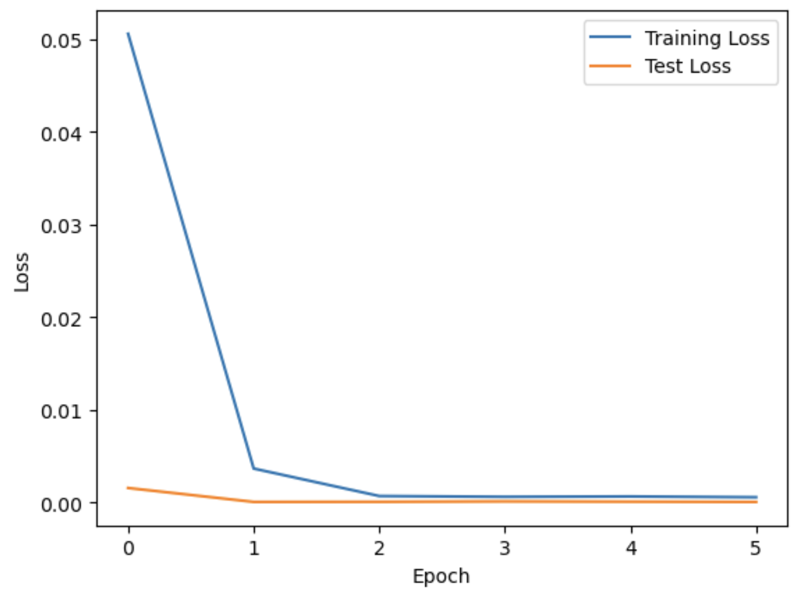
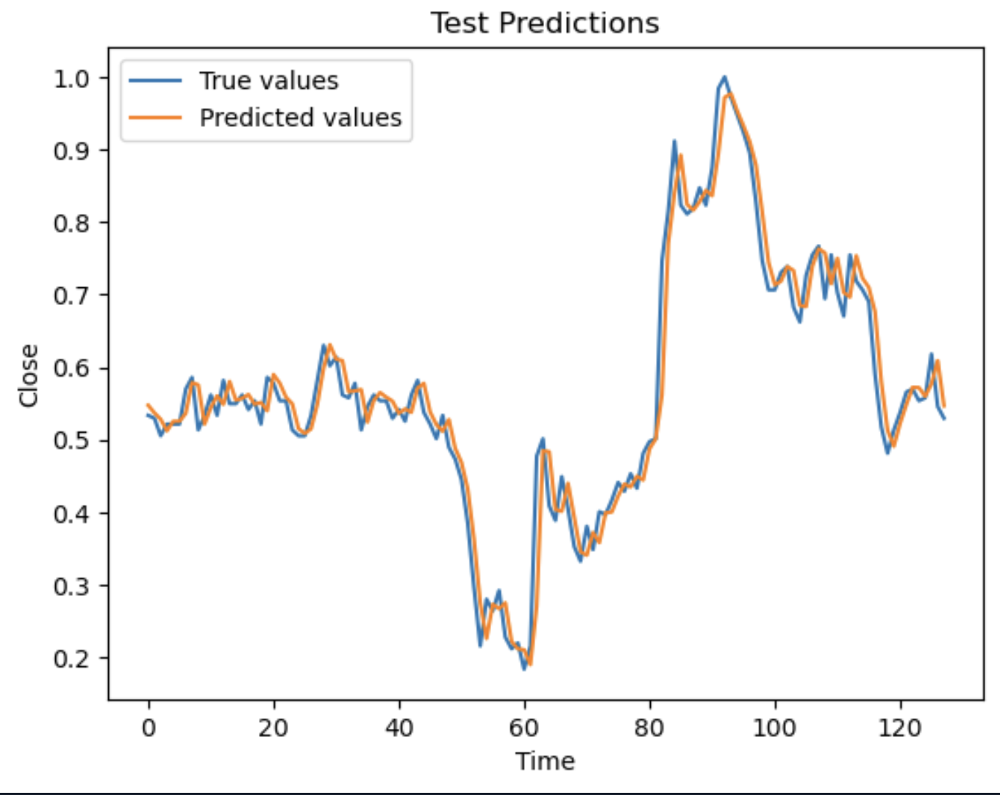

Stock Market Prediction with PyTorch using LSTM
=============================================================

## Overview

This project aims to predict the stock market trend of **Remedy Entertainment** (Video game development company) using Long Short-Term Memory (LSTM) with **PyTorch**. The goal is to develop a robust model that can accurately forecast future stock prices based on historical data.

## Dataset

The dataset used in this project is retrieved from a CSV file containing historical stock prices of Remedy Company. The dataset consists of the following features:

* Date
* Open
* High
* Low
* Close
* Volume

## Preprocessing

The following preprocessing techniques were applied to the dataset:

* Handling missing values
* Data normalization: Min-Max Scaler and Standard Scaler were used to normalize the data
* Feature engineering: The dataset was transformed into sequences of 7 days, with the target variable being the next day's close price
* Data splitting: The dataset was split into training (85%) and testing (15%) sets

## Model Architecture

The model architecture consists of an LSTM network with the following specifications:

* Input size: 2 (Close and Volume features)
* Hidden size: 64
* Number of layers: 4
* Batch size: 16
* Sequence length: 7

The model uses the Adam optimizer with a learning rate of 0.001 and the Huber loss function as the objective function.

## Training and Evaluation

The model was trained for 6 epochs, with the following evaluation metrics:

* Training loss: Huber loss
* Testing loss: Huber loss
* Evaluation metric: Mean Absolute Error (MAE)

The model was evaluated on the testing set, and the results are presented in the following sections.

## Results

### Loss Curves

The training and testing loss curves are shown below:

### Predictions

The predicted close prices for the testing set are shown below:

## Other Details

The following techniques were used in this project:

* **Batching**: The dataset was batched into sequences of 7 days, with a batch size of 16, to improve training efficiency.
* **Sequence-to-Sequence modeling**: The LSTM network was used to model the sequence-to-sequence relationship between the input sequence and the target sequence.
* **Huber loss function**: The Huber loss function was used as the objective function to reduce the impact of outliers on the model's performance.
* **Adam optimizer**: The Adam optimizer was used to adapt the learning rate during training, improving the model's convergence.

## Conclusion

This project demonstrates the application of RNN and LSTM networks to predict the stock market trend of Remedy Company. The model achieved promising results, with a good fit to the testing data.

